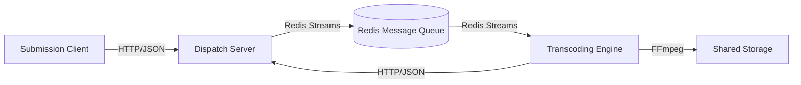

# DistConv System Architecture & Components

This document provides a detailed overview of the three main components of the **DistConv** distributed video transcoding system and how they interact to process video jobs at scale.

## System Overview

The DistConv system is designed around a central dispatcher that orchestrates work between client submissions and distributed worker nodes (engines).

## 1. Dispatch Server (`dispatch_server_cpp`)

The **Dispatch Server** is the "brain" of the operation. It is a high-performance C++17 application responsible for state management, job scheduling, and API exposure.

*   **Role**: Central coordinator. Accepts jobs from clients, queues them in Redis, manages the registry of available engines, and maintains the persistent state of all jobs.
*   **Technology Stack**:
    *   **Language**: C++17
    *   **Web Server**: `httplib` (Multi-threaded HTTP)
    *   **Message/Job Queue**: Redis (via `redis-plus-plus`)
    *   **Persistence**: SQLite
    *   **Architecture**: Thread-safe, event-driven
*   **Key Features**:
    *   **REST API**: Provides endpoints for job submission (`/jobs`), status checks, and engine heartbeats.
    *   **Intelligent Scheduling**: Matches jobs to engines based on capabilities (codecs) and load.
    *   **Reliability**: Uses Redis Streams for durable job queuing and delivery guarantees.
    *   **High Availability**: Stateless API design allows for potential horizontal scaling (with shared Redis/DB).

## 2. Transcoding Engine (`transcoding_engine`)

The **Transcoding Engine** is the "muscle" of the system. It runs on worker nodes, pulling jobs from the queue and processing them using FFmpeg.

*   **Role**: Worker node. Consumes jobs, performs CPU/GPU-intensive video transcoding, and reports progress.
*   **Technology Stack**:
    *   **Language**: C++17
    *   **Transcoding**: FFmpeg (via subprocess)
    *   **Communication**: Redis (for jobs) & HTTP (for status updates)
    *   **Local DB**: SQLite (for local queue management)
*   **Key Features**:
    *   **Message Consumer**: Uses Redis Consumer Groups to reliably process jobs.
    *   **Hardware Acceleration**: Automatically detects and utilizes GPU encoding (NVENC, VAAPI).
    *   **Robustness**: Handles FFmpeg failures, reporting specific errors back to the dispatcher.
    *   **Isolation**: Runs transcoding processes securely to prevent worker crashes.

## 3. Submission Client (`submission_client_desktop`)

The **Submission Client** is the "face" of the system for end-users. It allows users to easily submit videos for processing without dealing with raw API calls.

*   **Role**: User interface. validating files, configuring transcoding parameters (codecs, quality), and monitoring job status.
*   **Technology Stack**:
    *   **Language**: C++17
    *   **Framework**: Qt5 / Qt6
    *   **Network**: libcurl (or Qt Network)
*   **Key Features**:
    *   **Drag & Drop**: Simple UI for adding files.
    *   **Real-time Monitoring**: Polls the Dispatch Server to show live progress bars.
    *   **Cross-Platform**: Runs on Linux, Windows, and macOS.
    *   **Profile Management**: Saves common transcoding settings (e.g., "Web Optimized", "4K Archival").

## Data Flow

1.  **Submission**: User drops a file in the **Client**. The Client calls `POST /jobs` on the **Dispatch Server**.
2.  **Queuing**: The **Dispatch Server** validates the request, saves the job to SQLite "Pending", and publishes it to the **Redis** stream.
3.  **Assignment**: An idle **Transcoding Engine** (waiting on the Redis stream) reads the message. Redis ensures only one engine picks up the job (via Consumer Groups).
4.  **Processing**: The **Engine** sets the job state to "Processing" (notifying the Dispatcher via Redis or HTTP) and spawns **FFmpeg**.
5.  **Completion**: Upon success, the **Engine** updates the job status to "Completed" and might upload the result to shared storage. The **Client** sees the "Completed" status and notifies the user.
